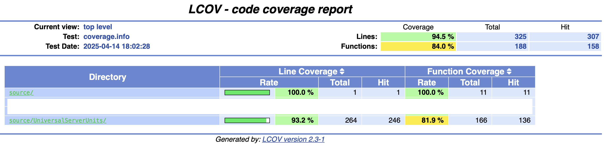

# Тестовое задание С++ в 

* Сделал: Степан Филимонов(khosta77)
* telegram: https://t.me/stepan_philimonov
* VK: https://vk.me/stepanphilimonv
* Почта: stepanfilimnov@mail.ru
* github: https://github.com/khosta77
* На связи 25/8

## Задание

### Краткий фоллоу-ап задания

Необходимо разработать конфигурируемое приложение для мониторинга состояния ОС Linux. Указанные в
конфигурационном файле метрики должны сохраняться в файл и/или выводиться в консоль с периодичностью
в N секунд.

Параметры, которые должны быть конфигурируемы:

* период снятия метрик системы (в секундах)

* варьируемый список отслеживаемых метрик системы:

    * загруженность ядер процессора

    * объем используемой / свободной оперативной памяти 

* вывод в консоль и/или в файл

**Примечание:** предполагается, что в будущем функциональность приложения будет расширяться. Например,
добавятся новые метрики, а собранные

**Примечание:** данные будут отправляться по сети.

### Причина выбора boost::fusion + nlohmann/json

Через метапрограммирование можно быстро считать данные в структуру данных, для удобного использования в
дальнейшем. Так же важно, что у нас будут заранее заданы конкретные форматы структур данных.

Так же структура фиксированная, если при получении сообщения конвертировать его в структуру, не будет
вспышек при обновлении данных 

## Сборка и запуск

Проект собирается и компилируется! Проверил на `mac OS 15` и `Ubuntu 24`.

1. Работа с Json реализована через [nlohmann/json](https://github.com/nlohmann/json?ysclid=m9h6e6grnw955784922)
 просто:

```cmd
git clone git@github.com:nlohmann/json.git
```

2. Надо проверить зависимости, должен быть `cmake>=3.28`, `clang++>=16.0`, `gtest` и `boost` (На `mac OS`
установлен через homebrew) и еще

* cmake `cmake --version`

* make `make --version`

* lcov `lcov --version`

* genhtml `genhtml --version`

* clang++ `clang++ --version`

3. Сборка & скомпилировать все

```cmd
cmake -DENABLE_COVERAGE=ON -B build
cd build
make
```

4. Подготовка файлов покрытия

```cmd
make coverage
```

5. Вызов программ:

```cmd
./SystemLoadServer.out
```

Можно так же передать ip и port для того, чтобы был пдонят микросервис, в него можно переслать структуру для
обновления данных.

#### Примечание

Возможно такое, что тесты сервера будут выдавать ошибку с `bind`. В системе не успевает пройтий нужная
очистка, просто перезапустите еще раз.

При введение через json надо быть аккуратным, опечатки ошибку выдадут и должны быть заполнены все поля.
взаимодействие с микросервисом если его поднять будет спецефичным, стандарт не описан в данном репозитории.

Через `TODO` указал, то где надо расширение написать, как было написано в условии.

## Об архитектуре решения


Моя идея была, сделать универсальный сервер, протестировать его работу, и новые микросервисы создавать 
путем написания отдельных ядер.

В директории `UniversalServerUnits` приведены универсальные методы для взаимодецствия по сети, они в классе
`UniversalServerUnits.hpp/UniversalServerMethods`. В том числе в этом класс методы и для взаимодействия по
json, структура задается через boost::fusion, использую библиотеку `nlohmann/json` для взаимодействия с json.
В `UniversalServer.hpp` сам сервер, в который надо передать ядро и он будет его вызывать. В `judge.hpp`
SFINAE для методов json. В `utils.hpp` класс для считывание данных из аргументов вызова программы. Дальше
все что начинается с `tests_*` тесты, почти 100% покрытие, эксепшены не до конца прописал, не успевал уже,
да и там они все одинаковые по факту...

В `SystemLoadServer` ядро для считывания и вывода данных о системе

В `SysInfoMac/Ubuntu` разная реализация для считывания данных о системе, для ubuntu или mac os

### Важно отметить

* Решил делать без многопоточного программирования, и так выходило очень много, боялся не успеть все сделать,
Но так в целом, в *ядра* и сервер без проблем можно встроить обычный threadpool и проблем не будет.

* Пользователи могут подключатся к сервису для приема и преобразования данных в любом колличестве, это не
остановит программу, главное чтобы успевалась проходить обработка. Так же для этого случая я сделал так,
чтобы в сервисе вывода выводилось имя пользователя(задается рандомно), для случая когда у нас несколько
подключений.

* Предполагается что сервисы будут запускатся так, как указано в п.5 **Сборка и запуск**. В случае если один
из сервисов отвалится, то будет *undefined behavior*, исходя из условия.


## Тесты

Тесты писал с использование gtest и gmock, как было по условию.



Почти полное покрытие, что-то не успевал уже дописать, но все ключевое, что есть в `UniversalServerUnits`
покрыто тестами почти на 100%.

`SystemLoadServer` не покрывал тестами, времени не хватило.

## P.s.

* Если возникли вопросы по работе, готов на них ответить всегда ответить.
